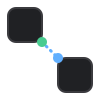

<h1>
   Enlace
</h1>

A visual, chained-execution canvas for any OpenAPI-documented API. Drag
operations onto a canvas, wire the output of one call into the input of the
next, and run the whole chain — independent branches execute concurrently —
directly from your browser.

Enlace only needs one thing: a valid OpenAPI 3.x document. It doesn't care
what produced or serves it — swagger-ui-express, Swashbuckle, Springdoc, a
hand-written file, anything.
